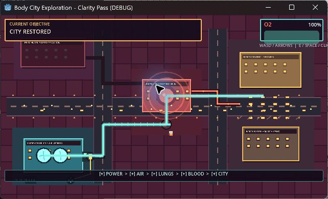

# Life City: First Breath

A compact educational exploration game set inside a living body-city. Play as a
maintenance worker restoring the newborn oxygen chain:

**Air → Lungs → Blood → Heart → Body**

The current release candidate is the **Body City Exploration Clarity prototype**.
It uses original procedural placeholder pixel art and a deterministic physiological
simulation. This is a design-validation prototype, not final production art.



## Play

Download the latest Windows ZIP from
[GitHub Releases](https://github.com/Michaelmas12121/Metabolis/releases), extract it,
and run `Life City First Breath.exe`.

Windows may show a SmartScreen warning because this student prototype is not
code-signed. Choose **More info → Run anyway** only when the ZIP came from this
repository's official Releases page.

### Controls

| Action | Controls |
| --- | --- |
| Move | WASD, arrow keys, or left-click a destination |
| Interact | E, Space, Enter, or click a nearby highlighted machine |
| Restart | R |

### Gameplay sequence

1. Retrieve the portable energy cell.
2. Install it at the Lung District.
3. Open the outside air intake.
4. Unfold the breathing chambers.
5. Travel to the Heart Hub and align the pulmonary pipe.
6. Watch the simulated oxygen recovery restore the city.

Incorrect machine order and critical oxygen are recoverable. There is no immediate
failure timer in this prototype.

## Development

- **Godot:** 4.7.1 stable (`a13da4feb`)
- **Renderer:** Compatibility
- **Internal viewport:** 640×360
- **Language:** GDScript
- **Default scene:**
  `experimental/body_city_exploration_clarity/clarity_main.tscn`

Clone the repository, open `project.godot` in Godot 4.7.1, and press **F6/F5**.

### Deterministic tests

From the repository root, using the Godot console binary:

```powershell
godot --headless --path . --script res://tests/simulation/test_runner.gd
godot --headless --path . --script res://tests/exploration/test_runner.gd
godot --headless --path . --script res://tests/exploration_clarity/test_runner.gd
```

Expected totals:

- 28 physiological simulation scenarios
- 5 accepted exploration prototype scenarios
- 6 gameplay-clarity scenarios covering the eight requested puzzle/recovery rules

### Windows export

Install the matching Godot 4.7.1 export templates, then run:

```powershell
godot --headless --path . --export-release "Windows Desktop"
```

The executable and PCK are written to `builds/windows/`. The `builds/` directory is
intentionally excluded from Git and should be attached to a reviewed GitHub Release
as a ZIP.

## Project structure

```text
data/                         Balance resources
experimental/
  body_city_exploration/      Accepted exploration prototype
  body_city_exploration_clarity/
                               Shareable clarity/payoff prototype
scenes/                       Earlier management prototype
scripts/                      Shared simulation and presentation code
tests/                        Deterministic headless test runners
docs/screenshots/             Manual 640×360 verification evidence
```

## Team

- Michael Liu
- Andrew Liu
- Kevin Zhao
- Michael Ma

## Scope and limitations

This prototype intentionally has no save system, networking, multiplayer, accounts,
final audio, second scenario, or additional organs. Physiological behavior is
simplified for interactive education and should not be treated as medical guidance.
